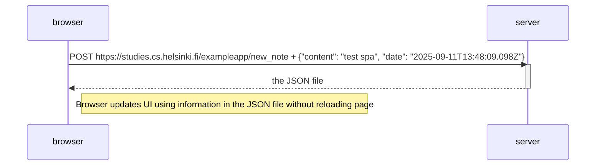

```mermaid
sequenceDiagram
    participant browser
    participant server

    browser->>server: POST https://studies.cs.helsinki.fi/exampleapp/new_note + {"content": "test spa",  "date": "2025-09-11T13:48:09.098Z"}
    activate server
    server-->>browser: the JSON file
    deactivate server
    Note right of browser: Browser updates UI using information in the JSON file without reloading page
```